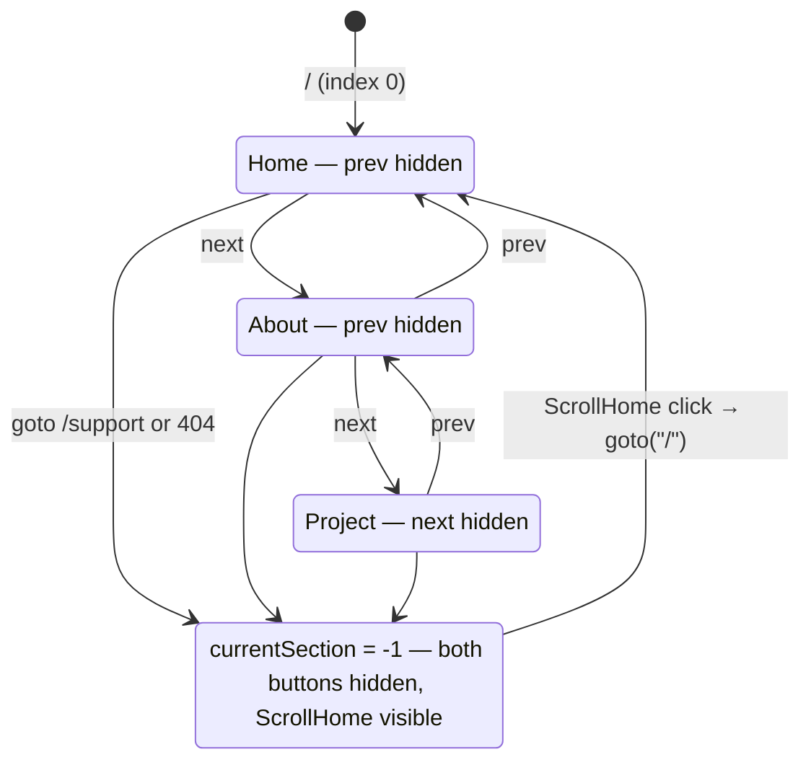

# Routes & Navigation

Route map of the site and the index-driven navigation contract.

## Route map

| Route      | Source                                  | Role                                     |
| ---------- | --------------------------------------- | ---------------------------------------- |
| `/`        | `src/routes/+page.svelte`               | Hero: name, tagline, `Social`, blog link |
| `/about`   | `src/routes/about/+page.svelte`         | Bio + `Stack` grid                       |
| `/project` | `src/routes/project/+page.svelte`       | `Card` grid from `PROJECT` constant      |
| `/support` | `src/routes/support/+page.svelte`       | Off-menu support page                    |
| `*` (404)  | `src/routes/[...notfound]/+page.svelte` | Catch-all, off-menu                      |

## Navigation contract

`MAIN_PAGE = ["/", "/about", "/project"]` (in `src/lib/constants/MainPage.ts`) defines the ordered pages. The `currentSection` store holds the current index into it; **`-1` means off-menu** (`/support`, 404). `NavigationButton` computes the index on mount from `window.location.pathname` via `MAIN_PAGE.indexOf`.

```ts
// src/lib/components/NavigationButton.svelte
function scrollTo(action: "prev" | "next") {
  const toSection = action === "prev" ? $currentSection - 1 : $currentSection + 1
  if (toSection < 0 || toSection > max - 1) return
  currentSection.update(() => toSection)
  goto(MAIN_PAGE[toSection])
}
```



## Invariants

- `MAIN_PAGE` order is meaningful — it is both the prev/next sequence and the index source. `/` must stay at index 0.
- Every navigation that changes the "section" must update `currentSection` **and** call `goto` together; they are kept in sync manually (see `ScrollHome.redirectHome` and about-page's `goToFirst` link).
- `ScrollHome` visibility rule: `hidden = $currentSection <= 1 && $currentSection !== -1` → hidden on `/` and `/about`, visible on `/project` and off-menu pages.
- Adding a main page = append its path to `MAIN_PAGE` and create `src/routes/<path>/+page.svelte`; the buttons adapt automatically (`max` derives from array length).
