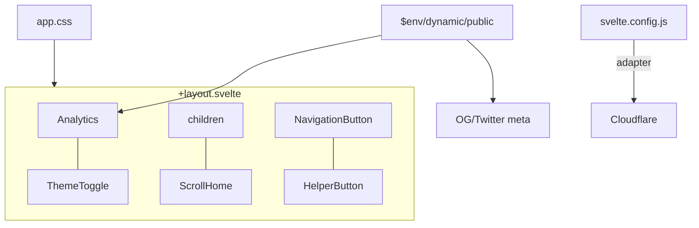

# App Shell

How the SvelteKit app is wired: config, adapters, preprocessing, environment, and the global layout.

## Build configuration

`svelte.config.js` uses **`@sveltejs/adapter-cloudflare`** — Cloudflare is the sole deploy target (Docker/ghcr publishing was removed).

Scripts are preprocessed with **`vitePreprocess()`** from `@sveltejs/vite-plugin-svelte`; it delegates TS and `<style lang="scss">`/CSS handling to Vite's pipeline (sass uses its modern compiler by default).

## Environment contract

Public runtime env vars (copy `.env.example` → `.env`):

| Variable                  | Used by                 | Effect when empty                                 |
| ------------------------- | ----------------------- | ------------------------------------------------- |
| `PUBLIC_BASE_URL`         | layout OG `og:url` meta | tag renders with empty content                    |
| `PUBLIC_GOOGLE_ANALYTICS` | `Analytics.svelte`      | gtag script tag and tracking are skipped entirely |

**Invariant**: env vars are always read through `$env/dynamic/public`, never `import.meta.env` or hardcoded values.

## Global layout (`src/routes/+layout.svelte`)

The layout owns all SEO head tags: `<title>` is `Gaung Ramadhan` on `/` and `Gaung Ramadhan | <path>` elsewhere; description, canonical, OG, and Twitter meta are static. It imports `../app.css`, then renders, in order: `Analytics`, `ThemeToggle`, page children (`{@render children()}`), `ScrollHome`, `NavigationButton`, `HelperButton`. Pages therefore never mount their own navigation chrome — see [routes.md](routes.md) and [ui/components.md](../ui/components.md).
