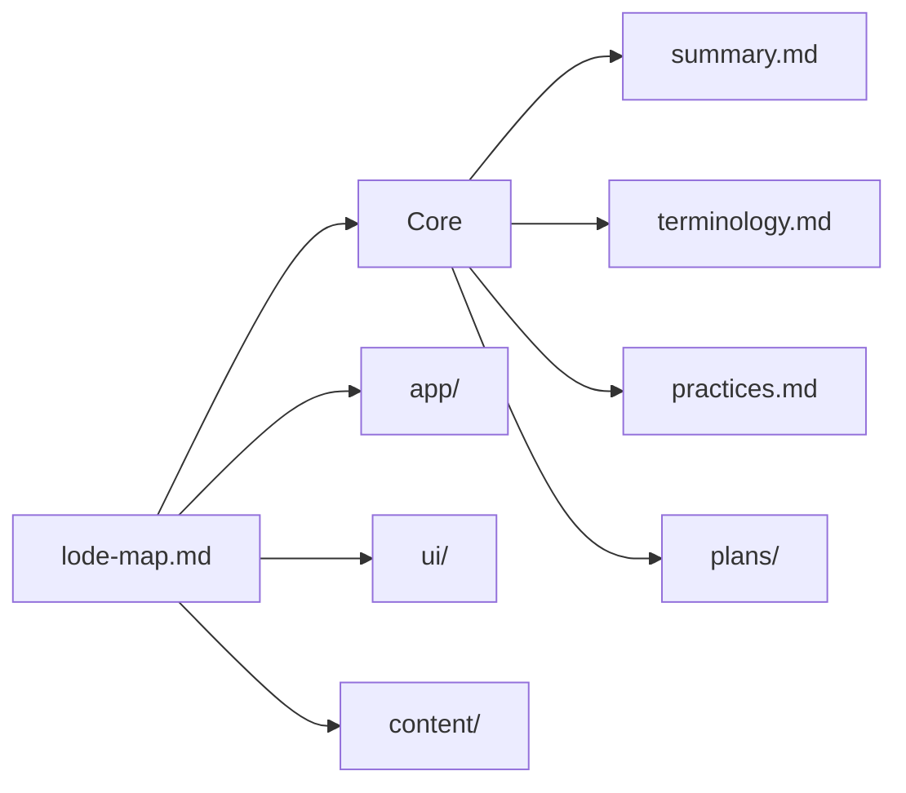

# Lode Map

Hierarchical index of every Lode file. Update when files are added/renamed.

## Core

- [summary.md](summary.md) — living one-paragraph snapshot of the whole project
- [terminology.md](terminology.md) — domain vocabulary (main page, section index, constants, …)
- [practices.md](practices.md) — commands, Svelte/styling/link conventions, lode discipline

## app/ — application shell

- [app/summary.md](app/summary.md) — SvelteKit config, adapters, preprocessing, env contract, global layout composition
- [app/routes.md](app/routes.md) — route map and the `MAIN_PAGE`/`currentSection` navigation contract
- [app/security.md](app/security.md) — server security headers from `src/hooks.server.ts`

## ui/ — interface layer

- [ui/summary.md](ui/summary.md) — styling stack: fonts, `app.css` tokens, transitions
- [ui/components.md](ui/components.md) — inventory and contracts of the 8 shared components
- [ui/theme.md](ui/theme.md) — dark mode: FOUC script, `isDarkMode` store, `iconDark` pattern

## content/ — content model

- [content/summary.md](content/summary.md) — constants as single source of site content
- [content/constants.md](content/constants.md) — `MAIN_PAGE`, `PROJECT`, `SOCIAL_LINKS`, `STACKS` shapes and invariants

## plans/

- [plans/roadmap.md](plans/roadmap.md) — roadmaps and TODOs (currently empty seed)

## tmp/

Git-ignored session scraps. Never linked from here.
