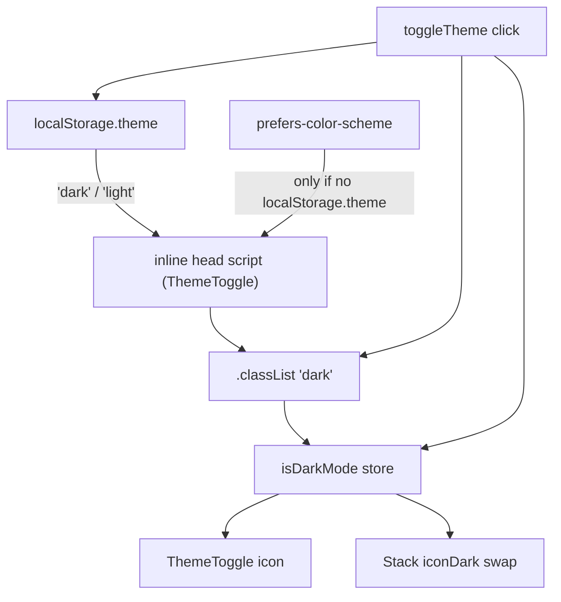

# Theme (Dark Mode)

Class-based dark mode: Tailwind's `dark:` variants activate when `<html>` has the `dark` class (`darkMode: "class"` in `tailwind.config.js`).

## Sources of truth

1. **Pre-paint (FOUC guard)** — `ThemeToggle.svelte` renders an inline script in `svelte:head` that adds/removes the `dark` class using `localStorage.theme === "dark"` or, when unset, `matchMedia("(prefers-color-scheme: dark)")`. This runs before first paint.
2. **Store sync** — `ThemeToggle` and `Stack` both `onMount`-sync `isDarkMode` from `document.documentElement.classList.contains("dark")` (components can't read the store before hydration and trust it).
3. **Toggle** — `toggleTheme` flips the class, sets `$isDarkMode`, and persists `localStorage.theme`.

## Contracts

- Components must style with `dark:` Tailwind variants; they may **read** `isDarkMode` (e.g. `Stack`'s `getIcon`) but must not write it — only `ThemeToggle` writes.
- Theme-sensitive images that only work on one background supply an `iconDark` variant (`Stack.ts`, e.g. Next.js light/dark logos).
- The persisted key is `theme` on `localStorage` root (`localStorage.theme`), values `"dark"` / `"light"`.
- If the CSP in [app/security.md](../app/security.md) is ever tightened, remember the FOUC inline script — it will need a nonce or hash.

## Invariants

- Never gate appearance on `prefers-color-scheme` in component code — that media query is consulted exactly once (first visit, no stored preference) inside the FOUC script.
- `onMount` re-sync from `<html>` is required in any component that branches on `$isDarkMode` for initial render decisions.
